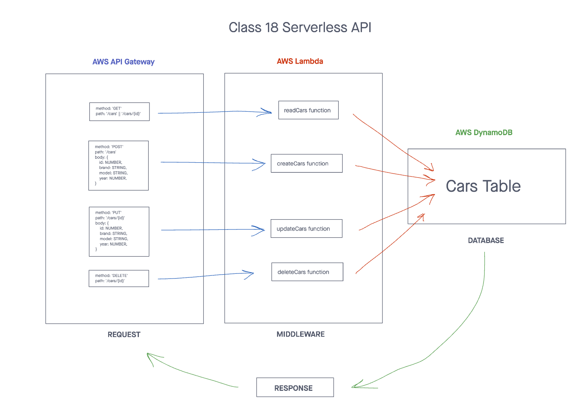

# Serverless API Delete
> This repository utilizes AWS Cloud Servers such as API Gateway (Routing), AWS Lambda Functions (CRUD Operation Handlers), and AWS DynamoDB (Database) to accomplish a DELETE requests.

## Installation

> Start with: `npm install`

## Usage

> To test, use: `npm test`

Get request:
```text
method: DELETE
route: /cars/{id}
```

Output:
> response with status code 204

## UML Diagram


## PR link
[DELETE Request PR link](https://github.com/cleecoloma/serverless-api-delete/pulls)

## Contributors
* Chester Lee Coloma
* ChatGPT helped with the tests